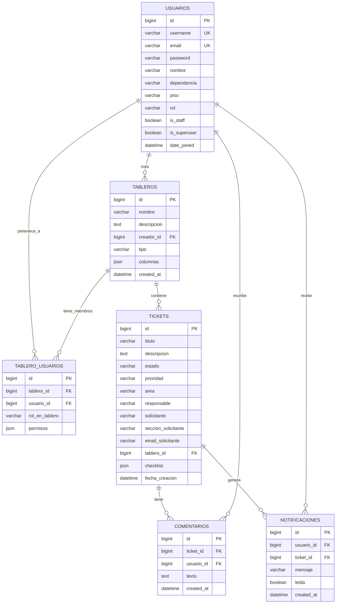

# Diagrama Entidad-Relación (DER)

## Diagrama visual



## Descripción de entidades

### USUARIOS (`usuarios`)

Extiende `AbstractUser` de Django. Almacena los perfiles de todos los usuarios del sistema.

| Campo | Tipo | Restricciones | Descripción |
|---|---|---|---|
| `id` | BIGINT | PK, auto-increment | Identificador único |
| `username` | VARCHAR(150) | UNIQUE | Usado como email para login |
| `email` | VARCHAR(254) | UNIQUE | Correo electrónico |
| `password` | VARCHAR(128) | | Hash de la contraseña |
| `nombre` | VARCHAR(200) | | Nombre completo del usuario |
| `dependencia` | VARCHAR(200) | | Área o departamento |
| `piso` | VARCHAR(50) | | Ubicación física |
| `rol` | VARCHAR(100) | Default: 'Usuario' | Rol global (Administrador, Jefe de Departamento, Soporte Tecnico, etc.) |
| `is_staff` | BOOLEAN | | Acceso al admin de Django |
| `is_superuser` | BOOLEAN | | Permisos totales |
| `date_joined` | DATETIME | | Fecha de creación |

### TABLEROS (`tableros`)

Tableros Kanban. Cada tablero tiene sus propias columnas configurables y un tipo (Trabajo o Personal).

| Campo | Tipo | Restricciones | Descripción |
|---|---|---|---|
| `id` | BIGINT | PK, auto-increment | Identificador único |
| `nombre` | VARCHAR(200) | | Nombre del tablero |
| `descripcion` | TEXT | | Descripción + config JSON embebida |
| `creador_id` | BIGINT | FK → USUARIOS | Quién creó el tablero |
| `tipo` | VARCHAR(50) | Default: 'Trabajo' | "Trabajo" o "Personal" |
| `columnas` | JSON | Default: [] | Lista ordenada de nombres de columna |
| `created_at` | DATETIME | auto_now_add | Fecha de creación |

> **Nota sobre `descripcion`**: Contiene un bloque oculto con configuración del tablero en formato `<!-- CONFIG:{"req_com":[],"col_inicial":"Solicitud","color":"#065E94"} -->`. Ver `src/utils/configTablero.js`.

### TABLERO_USUARIOS (`tablero_usuarios`)

Tabla de unión que define la membresía de cada usuario en cada tablero, con rol y permisos granulares.

| Campo | Tipo | Restricciones | Descripción |
|---|---|---|---|
| `id` | BIGINT | PK, auto-increment | Identificador único |
| `tablero_id` | BIGINT | FK → TABLEROS | Tablero al que pertenece |
| `usuario_id` | BIGINT | FK → USUARIOS | Usuario miembro |
| `rol_en_tablero` | VARCHAR(100) | Default: 'Usuario' | Rol dentro del tablero |
| `permisos` | JSON | NULLABLE | Permisos granulares personalizados |

**Constraint**: UNIQUE (tablero_id, usuario_id)

**Roles posibles en tablero**: Administrador, Jefe de Departamento, Mesa de ayuda, Usuario, Director, Visualizador, Soporte Tecnico

**Permisos granulares** (campo `permisos`):
```json
{
  "ver_tablero": true,
  "crear_tickets": true,
  "editar_tickets": true,
  "mover_tarjetas": true,
  "eliminar_tickets": false,
  "gestionar_comentarios": true,
  "ver_estadisticas": false,
  "gestionar_usuarios": false
}
```

### TICKETS (`tickets`)

Tickets de solicitud o notas dentro de un tablero.

| Campo | Tipo | Restricciones | Descripción |
|---|---|---|---|
| `id` | BIGINT | PK, auto-increment | Identificador único |
| `titulo` | VARCHAR(300) | | Título del ticket |
| `descripcion` | TEXT | | Descripción detallada |
| `estado` | VARCHAR(100) | Default: 'Solicitud' | Columna actual del ticket |
| `prioridad` | VARCHAR(50) | Default: 'Media' | Baja, Media, Alta, Urgente, Nota |
| `area` | VARCHAR(100) | | Soporte, Redes, Desarrollo |
| `responsable` | VARCHAR(500) | | Nombres separados por coma |
| `solicitante` | VARCHAR(200) | | Nombre de quien pide |
| `seccion_solicitante` | VARCHAR(200) | | Dependencia del solicitante |
| `email_solicitante` | VARCHAR(200) | | Email del solicitante |
| `tablero_id` | BIGINT | FK → TABLEROS | Tablero al que pertenece |
| `checklist` | JSON | Default: [] | Lista de subtareas |
| `fecha_creacion` | DATETIME | auto_now_add | Fecha de creación (se usa para ordenamiento) |

**Estructura del checklist**:
```json
[
  {"id": 1234567890, "texto": "Hacer algo", "completado": false},
  {"id": 1234567891, "texto": "Otra tarea", "completado": true}
]
```

### COMENTARIOS (`comentarios`)

Comentarios en tickets, incluyendo trazabilidad de auditoría automática.

| Campo | Tipo | Restricciones | Descripción |
|---|---|---|---|
| `id` | BIGINT | PK, auto-increment | Identificador único |
| `ticket_id` | BIGINT | FK → TICKETS | Ticket al que pertenece |
| `usuario_id` | BIGINT | FK → USUARIOS (SET_NULL) | Quién escribió (se preserva si se borra el usuario) |
| `texto` | TEXT | | Contenido del comentario |
| `created_at` | DATETIME | auto_now_add | Fecha de creación |

**Tipos de comentario por convención**:
- `[AUDITORÍA]:` — Generado automáticamente al mover/crear/editar tickets
- `[RESOLUCIÓN OFICIAL]:` — Comentario obligatorio al resolver un ticket
- Texto libre — Comentario manual del usuario

### NOTIFICACIONES (`notificaciones`)

Alertas enviadas a los miembros del tablero cuando se crean tickets.

| Campo | Tipo | Restricciones | Descripción |
|---|---|---|---|
| `id` | BIGINT | PK, auto-increment | Identificador único |
| `usuario_id` | BIGINT | FK → USUARIOS | Destinatario |
| `ticket_id` | BIGINT | FK → TICKETS | Ticket que generó la notificación |
| `mensaje` | VARCHAR(500) | | Texto de la alerta |
| `leida` | BOOLEAN | Default: false | Si ya fue vista |
| `created_at` | DATETIME | auto_now_add | Fecha de creación |

## Relaciones

```
USUARIOS ──1:N── TABLEROS          (creador)
USUARIOS ──N:M── TABLEROS          (a través de TABLERO_USUARIOS)
TABLEROS ──1:N── TICKETS
TICKETS  ──1:N── COMENTARIOS
USUARIOS ──1:N── COMENTARIOS       (autor)
TICKETS  ──1:N── NOTIFICACIONES
USUARIOS ──1:N── NOTIFICACIONES    (destinatario)
```

## Migración desde Supabase

La estructura de tablas es equivalente a la que usaba Supabase. Las diferencias principales son:

| Aspecto | Supabase (antes) | Django/MariaDB (ahora) |
|---|---|---|
| Motor | PostgreSQL | MariaDB 11.6 |
| Auth | Supabase Auth (JWT propio) | Django Session Auth |
| UUID ids | UUID v4 | BIGINT auto-increment |
| JSON fields | `jsonb` nativo | `JSONField` de Django |
| Realtime | Supabase Realtime (WebSocket) | Pendiente (polling temporal) |
| RLS | Row Level Security | Lógica en ViewSets de DRF |
